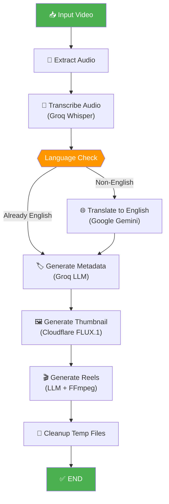

# 🎬 Content Automation — AI Video Content Pipeline

An end-to-end **AI-powered video content pipeline** that takes a raw video file and automatically generates transcripts, translations, SEO metadata, AI thumbnails, and viral short-form reels — then optionally publishes to **YouTube**, **Facebook**, and **Instagram**.

Built with **[LangGraph](https://github.com/langchain-ai/langgraph)** for orchestration, **Groq Whisper** for transcription, **Google Gemini** for translation, **Groq LLM** for metadata generation, and **Cloudflare FLUX.1** for AI thumbnail creation.

---

## ✨ Features

| Feature | Description |
|---|---|
| 🎙️ **Audio Extraction** | Extracts speech-optimized audio from video via FFmpeg (with MoviePy fallback) |
| 📝 **Transcription** | Transcribes audio using Groq Whisper Large V3 with precise timestamps |
| 🌐 **Translation** | Translates non-English transcripts to English using Google Gemini with batch processing |
| 🏷️ **SEO Metadata** | Generates YouTube-optimized title, description, tags & thumbnail prompt via Groq LLM |
| 🖼️ **AI Thumbnails** | Creates 1280×720 thumbnails using Cloudflare FLUX.1-schnell image generation |
| 🎬 **Reel Generation** | Identifies viral clips from transcript and renders 9:16 vertical reels via FFmpeg |
| 📤 **Social Publishing** | Upload to YouTube, post to Facebook Pages, and publish to Instagram (images & reels) |

---

## 📁 Project Structure

```
contentAutomation/
├── .env                          # Environment variables (API keys)
├── .python-version               # Python 3.13
├── pyproject.toml                # Project config & dependencies (uv/pip)
├── uv.lock                       # Lock file for uv package manager
├── LICENSE                       # MIT License
│
└── src/contentAutomation/
    ├── __init__.py
    ├── main.py                   # CLI entry point & pipeline orchestrator
    ├── config.py                 # Settings dataclass (loads .env)
    ├── utils.py                  # Subtitle generation, FFmpeg helpers, artifact saving
    │
    ├── models/
    │   ├── __init__.py
    │   └── model.py              # LLM client factories (Groq, Gemini)
    │
    ├── workflow/                  # LangGraph pipeline nodes
    │   ├── __init__.py
    │   ├── pipeline.py           # StateGraph definition & compilation
    │   ├── structure.py          # Pydantic models & TypedDict state
    │   ├── prompt.py             # System prompts for metadata & reels
    │   ├── extract_audio_node.py # Node 1: Audio extraction
    │   ├── transcribe_audio_node.py # Node 2: Whisper transcription
    │   ├── translate_node.py     # Node 3: Gemini translation (conditional)
    │   ├── generate_metadata_node.py # Node 4: SEO metadata generation
    │   ├── thumbnail_node.py     # Node 5: AI thumbnail generation
    │   ├── reel_node.py          # Node 6: Short-form reel generation
    │   └── cleanUp_node.py       # Node 7: Temp file cleanup
    │
    ├── meta/                     # Meta Platform publishing
    │   ├── facebook/
    │   │   ├── page_text.py      # Text post to Facebook Page
    │   │   ├── page_image.py     # Image post to Facebook Page
    │   │   ├── page_reel.py      # Reel upload to Facebook Page
    │   │   └── page_upload.py    # Convenience runner for all post types
    │   └── instagram/
    │       ├── insta_utils.py    # Container polling & publishing helpers
    │       ├── insta_post_image.py # Image post to Instagram
    │       └── insta_post_reels.py # Reel post to Instagram
    │
    └── youtube/                  # YouTube Data API v3 integration
        ├── authentication.py     # OAuth 2.0 authentication flow
        ├── content_upload.py     # Video upload with resumable chunks
        └── content_update.py    # Update existing video metadata
```

---

## 🔄 Pipeline Flow (LangGraph)

The core pipeline is a **LangGraph `StateGraph`** that processes video through a sequence of AI-powered nodes:



### Node-by-Node Breakdown

#### 1. Extract Audio (`extract_audio_node`)
- Extracts mono, 16kHz, 64kbps MP3 audio optimized for speech recognition.
- **Primary method**: FFmpeg direct extraction (fast, memory-efficient).
- **Fallback**: MoviePy if FFmpeg is not installed.

#### 2. Transcribe Audio (`transcribe_audio_node`)
- Sends audio to **Groq Whisper Large V3** for transcription.
- Returns timestamped segments with per-segment `start`/`end` times.
- **Smart chunking**: Only splits audio into 20-minute chunks if file exceeds 24 MB or 25 minutes.
- **Auto-retry**: Exponential backoff on API failures (3 attempts).
- **Language detection**: Identifies source language from Whisper response.

#### 3. Translate to English (`translate_node`) — *Conditional*
- **Skipped if**: Audio is already English or translation is explicitly disabled.
- Uses **Google Gemini** (`gemini-2.5-flash`) with structured JSON output.
- **Batch processing**: Processes 150 segments per batch with concurrent workers.
- **Pydantic validation**: Validates every response against `BatchTranslationResponse` schema.
- **Self-healing**: Failed batches are subdivided and retried independently.
- Preserves original timestamps exactly.

#### 4. Generate Metadata (`generate_metadata_node`)
- Uses **Groq LLM** (`openai/gpt-oss-120b` via LangChain) with structured output.
- Generates: `title`, `description`, `tags` (7-12 SEO keywords), and `image_prompt` for thumbnail.
- Truncates very long transcripts to 30K characters for context window safety.

#### 5. Generate Thumbnail (`thumbnail_node`)
- Calls **Cloudflare Workers AI** running **FLUX.1-schnell** model.
- Decodes base64 image response → center-crops to 16:9 → resizes to 1280×720.
- Saves as high-quality JPEG (90%).

#### 6. Generate Reels (`reel_node`)
- Uses **Groq LLM** to analyze timestamped transcript and identify the best 15–90 second standalone clips.
- For each clip, renders a **9:16 vertical video** (1080×1920) using FFmpeg:
  - Scales video with a clean white border.
  - Letterboxes into the target frame with black padding.
  - Encodes with H.264 Main profile + AAC audio.
- Generates metadata per reel: title, hook, caption with hashtags, and reasoning.

#### 7. Cleanup (`cleanUp_node`)
- Removes temporary audio files and transcription chunks.
- Final temp directory cleanup happens in the `main.py` `finally` block.

---

## 🛠️ Prerequisites

### System Dependencies

| Dependency | Required | Purpose |
|---|---|---|
| **Python** | ≥ 3.13 | Runtime |
| **FFmpeg** | Highly Recommended | Audio extraction, reel rendering |
| **uv** | Recommended | Fast Python package manager |

### API Keys Required

| Key | Service | Used For |
|---|---|---|
| `GROQ_API_KEY` | [Groq](https://console.groq.com/) | Whisper transcription & LLM metadata/reels |
| `GOOGLE_API_KEY` | [Google AI Studio](https://aistudio.google.com/apikey) | Gemini translation |
| `CLOUDFLARE_ACCOUNT_ID` | [Cloudflare](https://dash.cloudflare.com/) | AI thumbnail generation |
| `CLOUDFLARE_API_TOKEN` | [Cloudflare](https://dash.cloudflare.com/) | AI thumbnail generation |
| `PAGE_ID` | [Meta for Developers](https://developers.facebook.com/) | Facebook Page posting |
| `PAGE_ACCESS_TOKEN` | [Meta for Developers](https://developers.facebook.com/) | Facebook Page posting |
| `INSTAGRAM_ACCOUNT_ID` | [Meta for Developers](https://developers.facebook.com/) | Instagram posting |
| `ACCESS_TOKEN` | [Meta for Developers](https://developers.facebook.com/) | Instagram API access |

> **Note**: For YouTube uploads, you need a `client_secret.json` file from the [Google Cloud Console](https://console.cloud.google.com/) with YouTube Data API v3 enabled. OAuth tokens are saved locally as `token_upload.json` / `token_metadata.json`.

---

## 🚀 Installation & Setup

### 1. Clone the Repository

```bash
git clone https://github.com/your-username/contentAutomation.git
cd contentAutomation
```

### 2. Install FFmpeg

<details>
<summary><b>🐧 Linux (Ubuntu/Debian)</b></summary>

```bash
sudo apt update
sudo apt install ffmpeg
ffmpeg -version
```

</details>

<details>
<summary><b>🐧 Linux (Fedora/RHEL)</b></summary>

```bash
sudo dnf install ffmpeg
ffmpeg -version
```

</details>

<details>
<summary><b>🐧 Linux (Arch)</b></summary>

```bash
sudo pacman -S ffmpeg
ffmpeg -version
```

</details>

<details>
<summary><b>🍎 macOS</b></summary>

```bash
brew install ffmpeg
ffmpeg -version
```

</details>

<details>
<summary><b>🪟 Windows</b></summary>

**Option A — winget (Windows 11+):**
```powershell
winget install FFmpeg
```

**Option B — Chocolatey:**
```powershell
choco install ffmpeg
```

**Option C — Manual:**
1. Download from [ffmpeg.org/download](https://ffmpeg.org/download.html).
2. Extract and add the `bin/` folder to your system `PATH`.

Verify:
```powershell
ffmpeg -version
```

</details>

### 3. Install Python Dependencies

#### Using `uv` (Recommended)

```bash
# Install uv if not already installed
# Linux / macOS:
curl -LsSf https://astral.sh/uv/install.sh | sh

# Windows (PowerShell):
powershell -ExecutionPolicy ByPass -c "irm https://astral.sh/uv/install.ps1 | iex"

# Create virtual environment and install dependencies
uv sync
```

#### Using `pip` (Alternative)

```bash
# Create virtual environment
python3.13 -m venv .venv

# Activate virtual environment
# Linux / macOS:
source .venv/bin/activate

# Windows (PowerShell):
.\.venv\Scripts\Activate.ps1

# Windows (CMD):
.\.venv\Scripts\activate.bat

# Install the package
pip install -e .
```

### 4. Configure Environment Variables

Copy and edit the `.env` file in the project root:

```bash
cp .env .env.local   # Optional: keep a local copy
```

Fill in your API keys:

```dotenv
# Groq (Required — transcription & LLM)
GROQ_API_KEY=gsk_your_groq_api_key_here

# Google Gemini (Required for translation of non-English videos)
GOOGLE_API_KEY=your_google_api_key_here

# Cloudflare Workers AI (Required for AI thumbnails)
CLOUDFLARE_ACCOUNT_ID=your_cloudflare_account_id
CLOUDFLARE_API_TOKEN=your_cloudflare_api_token

# Meta / Facebook (Optional — for Facebook Page posting)
PAGE_ID=your_facebook_page_id
PAGE_ACCESS_TOKEN=your_page_access_token

# Instagram (Optional — for Instagram posting)
INSTAGRAM_ACCOUNT_ID=your_instagram_account_id
ACCESS_TOKEN=your_instagram_access_token
```

---

## ▶️ Usage

### Basic Usage

```bash
# Using uv
uv run python -m contentAutomation.main --video your_video.mp4

# Using activated virtualenv
python -m contentAutomation.main --video your_video.mp4
```

### CLI Options

```
usage: main.py [-h] [--video VIDEO] [--no-translate] [--no-reels]
               [--max-reels MAX_REELS] [--output-dir OUTPUT_DIR] [--debug]

CMS AI Video Content Pipeline

options:
  -h, --help                     Show this help message and exit
  --video, -v VIDEO              Path to input video file (default: demo.mp4)
  --no-translate                 Disable automatic translation to English
  --no-reels                     Disable automatic 9:16 short-form reel generation
  --max-reels MAX_REELS          Maximum number of 9:16 reels to generate (default: 2)
  --output-dir, -o OUTPUT_DIR    Directory to save generated artifacts (default: output/)
  --debug                        Enable debug logging output
```

### Examples

```bash
# Process a video with all features enabled (default)
uv run python -m contentAutomation.main -v lecture.mp4

# Skip translation (video is already in English)
uv run python -m contentAutomation.main -v podcast.mp4 --no-translate

# Generate up to 5 reels
uv run python -m contentAutomation.main -v vlog.mp4 --max-reels 5

# Disable reel generation entirely
uv run python -m contentAutomation.main -v tutorial.mp4 --no-reels

# Custom output directory with debug logs
uv run python -m contentAutomation.main -v demo.mp4 -o results/ --debug

# Combine multiple options
uv run python -m contentAutomation.main -v interview.mp4 --no-translate --max-reels 3 -o my_output/
```

---

## 📦 Output Artifacts

After a successful run, the pipeline saves everything to `output/<video_name>/`:

```
output/
└── your_video/
    ├── metadata.json              # Title, description, tags, image prompt
    ├── metadata.md                # Human-readable metadata summary
    ├── transcript.txt             # Full-text transcript
    ├── transcript_timestamps.txt  # Timestamped transcript
    ├── subtitles_original.srt     # SRT subtitles in original language
    ├── subtitles_english.srt      # SRT subtitles in English (if translated)
    ├── thumbnail.jpg              # AI-generated 1280×720 thumbnail
    └── reels/
        ├── reels_metadata.json    # Reel titles, hooks, captions, timestamps
        ├── reels_summary.md       # Human-readable reels summary
        ├── reel_1.mp4             # 9:16 vertical reel video
        └── reel_2.mp4             # 9:16 vertical reel video
```

---

## 📤 Social Media Publishing (Standalone Modules)

The `meta/` and `youtube/` modules can be used independently from the pipeline:

### Facebook Page

```python
from contentAutomation.meta.facebook.page_text import post_text
from contentAutomation.meta.facebook.page_image import post_image
from contentAutomation.meta.facebook.page_reel import post_reel

# Post text
post_text("Hello from my automated pipeline!")

# Post an image (local file)
post_image("Check this out!", "path/to/image.jpg", is_url=False)

# Post an image (URL)
post_image("Amazing view!", "https://example.com/image.jpg", is_url=True)

# Post a reel
post_reel("Trending! #viral #shorts", "path/to/reel.mp4")
```

### Instagram

```python
from contentAutomation.meta.instagram.insta_post_image import post_instagram_image
from contentAutomation.meta.instagram.insta_post_reels import post_instagram_reel

# Post an image (must be a publicly accessible URL)
post_instagram_image("https://example.com/image.jpg", "Beautiful shot! #photography")

# Post a reel (must be a publicly accessible URL)
post_instagram_reel("https://example.com/reel.mp4", "Watch this! #trending")
```

> **Instagram Note**: The Instagram Graph API requires media URLs to be **publicly accessible** — local file paths are not supported.

### YouTube

```python
from contentAutomation.youtube.content_upload import upload_video
from contentAutomation.youtube.content_update import update_video_metadata

# Upload a video (first run will open a browser for OAuth consent)
video_id = upload_video(
    video_file_path="output/my_video/reel_1.mp4",
    title="My Awesome Video",
    description="Generated by Content Automation pipeline",
    tags=["automation", "AI", "content"],
)

# Update metadata of an existing video
update_video_metadata(
    video_id="your_video_id",
    new_title="Updated Title",
    new_description="Updated description",
)
```

> **YouTube Note**: You need a `client_secret.json` from Google Cloud Console with YouTube Data API v3 enabled. On the first run, a browser window will open for OAuth 2.0 consent. Tokens are cached locally.

---

## ⚙️ Configuration Reference

All settings are managed via environment variables (loaded from `.env`) and centralized in `config.py`:

| Variable | Default | Description |
|---|---|---|
| `GROQ_API_KEY` | — | Groq API key for Whisper & LLM |
| `GROQ_CHAT_MODEL` | `openai/gpt-oss-120b` | Groq chat model for metadata & reel extraction |
| `GROQ_WHISPER_MODEL` | `whisper-large-v3` | Whisper model for transcription |
| `GROQ_TIMEOUT` | `600.0` | Groq API request timeout (seconds) |
| `GOOGLE_API_KEY` | — | Google API key for Gemini translation |
| `GOOGLE_TRANSLATION_MODEL` | `gemini-2.5-flash` | Gemini model for translation |
| `CLOUDFLARE_ACCOUNT_ID` | — | Cloudflare account ID |
| `CLOUDFLARE_API_TOKEN` | — | Cloudflare Workers AI API token |
| `META_API_VERSION` | `v22.0` | Facebook/Instagram Graph API version |
| `PAGE_ID` | — | Facebook Page ID |
| `PAGE_ACCESS_TOKEN` | — | Facebook Page access token |
| `INSTAGRAM_ACCOUNT_ID` | — | Instagram business account ID |
| `ACCESS_TOKEN` | — | Instagram/Meta access token |
| `YOUTUBE_CLIENT_SECRETS_FILE` | `client_secret.json` | Path to YouTube OAuth client secrets |
| `YOUTUBE_TOKEN_FILE` | `token_upload.json` | Path to cached YouTube OAuth token |

---

## 🏗️ Tech Stack

| Layer | Technology |
|---|---|
| **Orchestration** | LangGraph (StateGraph) |
| **Transcription** | Groq Whisper Large V3 |
| **Translation** | Google Gemini 2.5 Flash |
| **Metadata LLM** | Groq (openai/gpt-oss-120b via LangChain) |
| **Thumbnail AI** | Cloudflare Workers AI (FLUX.1-schnell) |
| **Video Processing** | FFmpeg, MoviePy |
| **Audio Processing** | pydub |
| **Data Validation** | Pydantic v2 |
| **Package Manager** | uv |
| **Language** | Python 3.13 |

---

## 🐛 Troubleshooting

| Issue | Solution |
|---|---|
| `FFmpeg not found` | Install FFmpeg (see [Installation](#2-install-ffmpeg)). The pipeline will fallback to MoviePy for audio extraction, but reel generation requires FFmpeg. |
| `GROQ_API_KEY not set` | Add your Groq API key to the `.env` file. Get one at [console.groq.com](https://console.groq.com/). |
| `GOOGLE_API_KEY is not configured` | Required only for non-English video translation. Add it to `.env` or use `--no-translate`. |
| `Cloudflare credentials not configured` | Thumbnail generation will be skipped. Add `CLOUDFLARE_ACCOUNT_ID` and `CLOUDFLARE_API_TOKEN` to `.env`. |
| `Audio extraction failed` | Ensure the input video file has an audio stream. Check file integrity with `ffprobe your_video.mp4`. |
| `Groq Whisper rate limit` | The pipeline auto-retries with exponential backoff (up to 3 attempts). Wait a moment and retry. |
| `Translation batch failed` | Batches are automatically subdivided and retried. Original text is used as fallback if all retries fail. |

---

## 📄 License

This project is licensed under the **MIT License** — see the [LICENSE](LICENSE) file for details.

**Copyright © 2026 Abhijit Dey**
